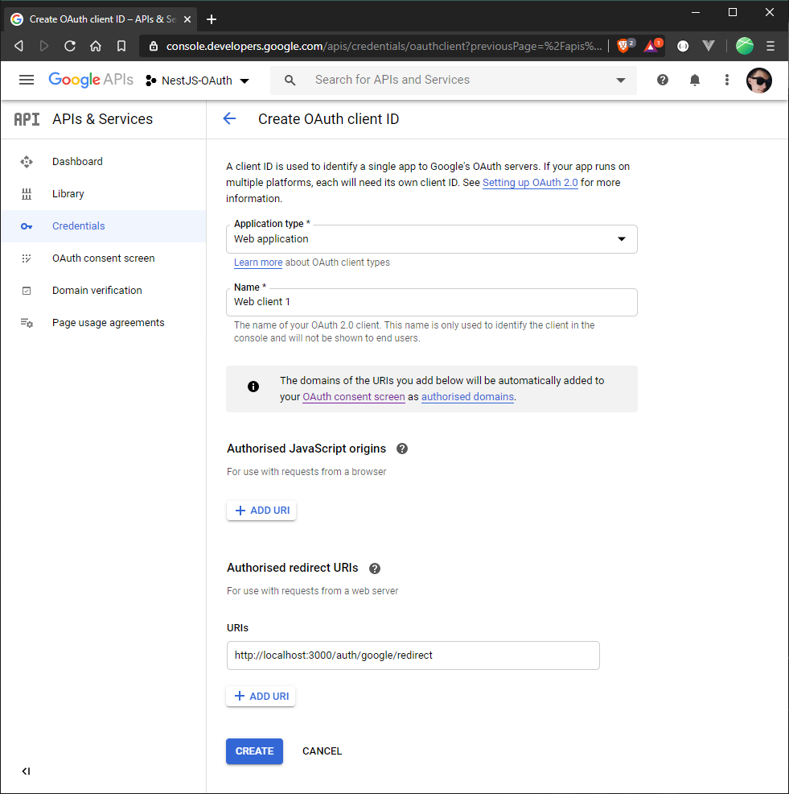

Nowadays it is very convenient to have account in one place and using it to authenticate in many places. This way is also more secure , because we don’t need remember password or using same as in other portals. Today we will connect signing in with Google.

This is a third post from series about NestJS and OAuth, you can find code from this post on my [Github](https://github.com/raspi684/NestJS-OAuth/tree/OAuth-Google). Today we will add sign in with Google.

## Adding Sign in with Google

### Creating a project in Google

Go to [console.developers.google.com](https://console.developers.google.com/projectcreate) and add a new project.


When it's done, open menu and click "APIs & Services". Firstly you have to enable Google+ API. To do this, go to library, type "google+" and enable "Google+ API". Next go back to "APIs & Services" and then "Credentials".


If consent screen wasn't configured yet, the wizard will guide you through this process. Now click "Create credentials", then select "OAuth client ID". Now you should have this wizard:


After this step, you get client ID and client Secret, which we use in our application (in .env file).

### Installing packages

Now install packages for google oauth:

- `$ npm install --save passport-google-oauth20`
- `$ npm install -D @types/passport-google-oauth20`

In this case we will only add a new strategy and a few methods in auth modules. Let's start from strategy.

```ts
// google-strategy.ts
import { PassportStrategy } from "@nestjs/passport";
import { Strategy, VerifyCallback } from "passport-google-oauth20";
import { Injectable } from "@nestjs/common";

@Injectable()
export class GoogleStrategy extends PassportStrategy(Strategy, "google") {
  constructor() {
    super({
      clientID: process.env.GOOGLE_CLIENT_ID,
      clientSecret: process.env.GOOGLE_SECRET,
      callbackURL: "http://localhost:3000/auth/google/redirect",
      scope: ["email", "profile"],
    });
  }

  async validate(
    accessToken: string,
    refreshToken: string,
    profile: any,
    done: VerifyCallback
  ): Promise<any> {
    const { name, emails } = profile;
    const user = {
      email: emails[0].value,
      firstName: name.givenName,
      lastName: name.familyName,
      accessToken,
    };
    done(null, user);
  }
}
```

When it's done, we have to add this strategy to providers in auth module, same as the JwtStrategy. Next let's modify auth controller by adding two endpoints.

```ts
// auth.controller.ts
import { Controller, UseGuards, Post, Req, Get } from "@nestjs/common";
import { AuthGuard } from "@nestjs/passport";
import { AuthService } from "./auth.service";

@Controller("auth")
export class AuthController {
  constructor(private authService: AuthService) {}

  @UseGuards(AuthGuard("local"))
  @Post("login")
  async login(@Req() req) {
    return this.authService.login(req.user);
  }

  @UseGuards(AuthGuard("google"))
  @Get("google")
  async signInWithGoogle() {}

  @UseGuards(AuthGuard("google"))
  @Get("google/redirect")
  async signInWithGoogleRedirect(@Req() req) {
    return this.authService.signInWithGoogle(req);
  }
}
```

As you can see, `signInWithGoogle()` method isn't exists yet, so create it in auth service:

```ts
// auth.service.ts
import {
  Injectable,
  BadRequestException,
  ForbiddenException,
} from "@nestjs/common";
import { UsersService } from "src/users/users.service";
import { User } from "src/users/user.entity";
import { JwtService } from "@nestjs/jwt";

@Injectable()
export class AuthService {
  constructor(
    private usersService: UsersService,
    private jwtService: JwtService
  ) {}

  async validateUser(username: string, password: string): Promise<User | null> {
    const user = (
      await this.usersService.findBy({ where: [{ email: username }] })
    )[0];
    if (user && user.password === password) return user;
    return null;
  }

  async login(user: User) {
    return {
      access_token: this.jwtService.sign(
        {
          sub: user.id,
          email: user.email,
        },
        {
          secret: process.env.JWT_SECRET,
          expiresIn: process.env.JWT_EXPIRE_TIME,
        }
      ),
    };
  }

  async signInWithGoogle(data) {
    if (!data.user) throw new BadRequestException();

    let user = (
      await this.usersService.findBy({ where: [{ googleId: data.user.id }] })
    )[0];
    if (user) return this.login(user);

    user = (
      await this.usersService.findBy({ where: [{ email: data.user.email }] })
    )[0];
    if (user)
      throw new ForbiddenException(
        "User already exists, but Google account was not connected to user's account"
      );

    try {
      const newUser = new User();
      newUser.firstName = data.user.firstName;
      newUser.lastName = data.user.lastName;
      newUser.email = data.user.email;
      newUser.googleId = data.user.id;

      await this.usersService.store(newUser);
      return this.login(newUser);
    } catch (e) {
      throw new Error(e);
    }
  }
}
```

### Testing solution

There we have 3 cases:

1.  An user is already in database and his Google account was connected to account in our app
2.  An user is already in database, but his Google account wasn't connected yet to account in our app
3.  An user doesn't exist in our database

Now we can test it, when you enter `http://localhost:3000/auth/google` app should redirect you to Google:


And now, let's test all of these 3 cases:

1.  I am a new user:
    
    As you can see, a new record was added.
    
2.  Let's modify googleId (or remove it):
    
    
3.  I am a user with connected google account:
    
    

Everything works perfectly! And that's all in this part.

## What do you think about this article?

Do you have any questions? Or maybe I explained something vaguely? Ask it below!
